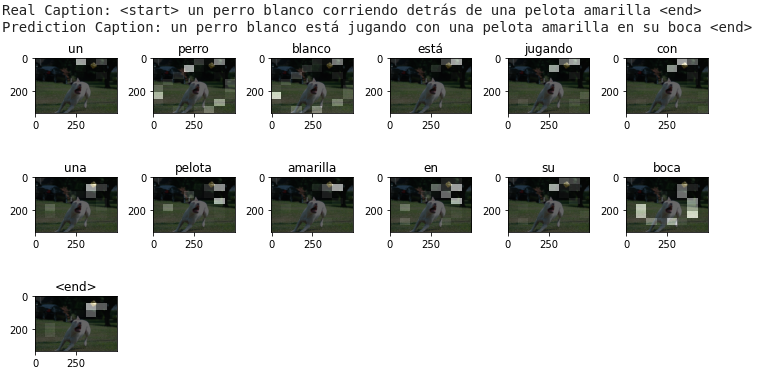
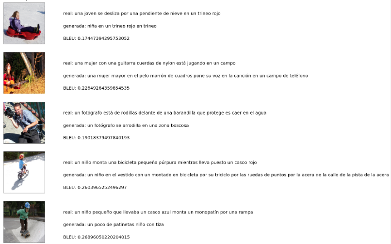
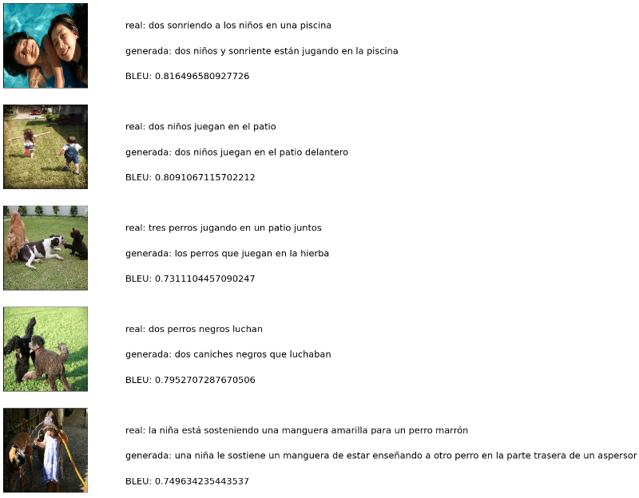

# ShowAttendTell_Flickr8k_Spanish
This is a repository for the paper "Evaluation of the neural model of visual attention in the automatic
description of images in Spanish" from Gallardo-García, Beltrán-Martínez and Vilariño-Ayala.

## Spanish version Flickr8k dataset (machine translated)
The file "es_Flickr8k.token.txt" contains the translated descritions of each image in the original Flickr8k
dataset. It is also avaibale from the following [link](https://url2.cl/XYxj6). This file contains a total of 
40,455 captions (rows) per each of the 8,091 images in the Flickr8k dataset. Each row contain the filename of the image that describes, the ID of de caption and the caption's text, the columns are divided by ",".

The original form from the University of Illinois is not working anymore to download the dataset but 8k images of
the dataset can be downloaded from the Jason Brownlee's [GitHub](https://github.com/jbrownlee/Datasets/releases/download/Flickr8k/Flickr8k_Dataset.zip).

## Examples and code: The jupyter Notebook
The jupyter notebook "Flickr_Image_Captioning.ipynb" contains all the code and comments to understand and repeat the results with the "es_Flickr8k.token.txt" dataset.

This code is based on the [Tensorflow image captioning with visual attention tutorial](https://www.tensorflow.org/tutorials/text/image_captioning).

### Examples
1. An example of the attention plot generated by the model:


2. Examples of bad captions generated by the model:


3. Examples of good captions generated by the model:



## Citations
If you use the translated versión of the Flickr8k dataset and you would like to cite:
```
@article{Gallardo2020attention,
	title={Evaluación del modelo neuronal de atención visual en la descripción automática de imágenes en Español},
	author={Gallardo-García, Rafael and Beltrán-Martínez, Beatriz and Vilariño-Ayala, Darnes},
}
```
If you use the original Flickr8k dataset, please cite the authors as following:
```
@article{Hodosh2013,
	title={Framing image description as a ranking task: Data, models and evaluation metrics},
	author={Hodosh, Micah and Young, Peter and Hockenmaier, Julia},
	journal={Journal of Artificial Intelligence Research},
	volume={47},
	pages={853--899},
	year={2013}
}
